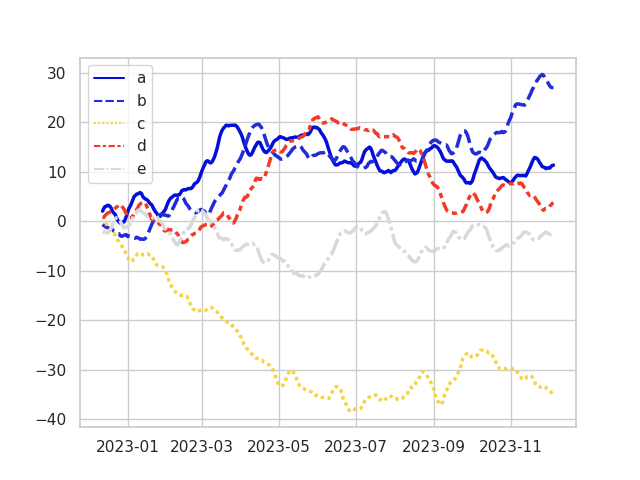
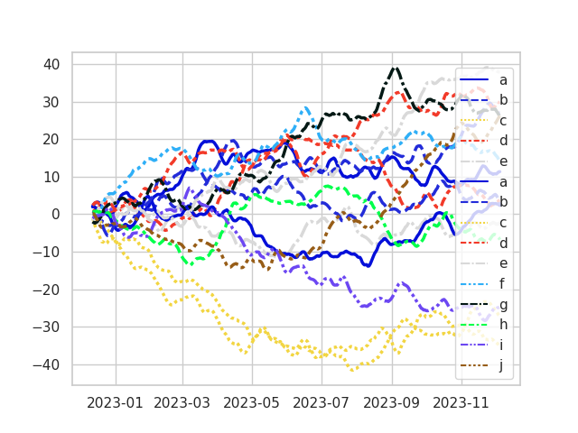
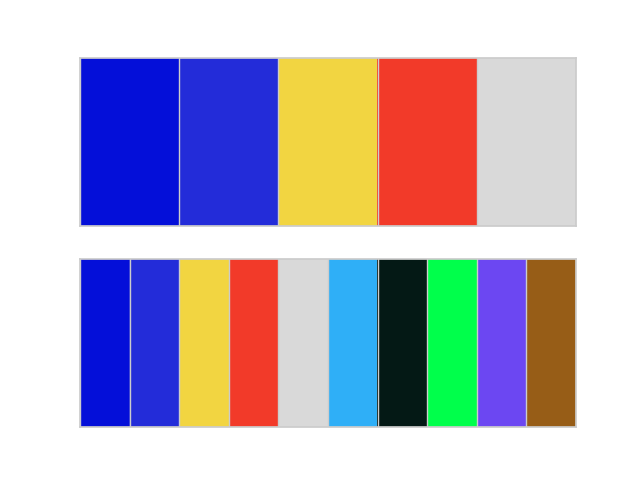
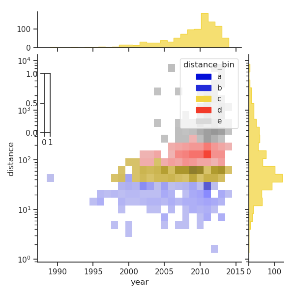
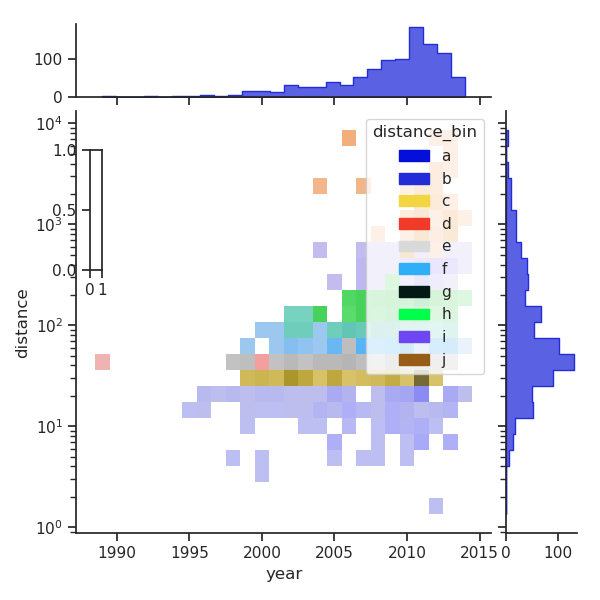
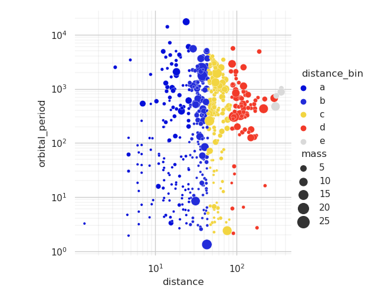
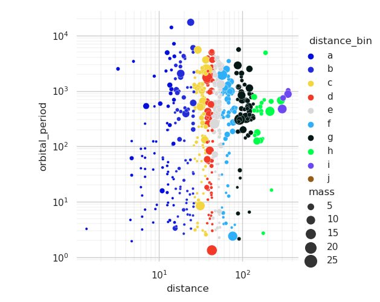
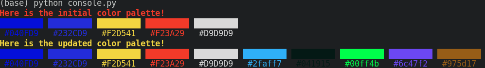

# Table of Contents

1.  [Rationale](#org96cbdd2)
2.  [Source](#orgaa3544f)
3.  [Usage](#org4aa67dd)
    1.  [Note](#orga9adba5)
4.  [Examples](#orge9c5a0e)
    1.  [Plotting](#orgedaed3b)
        1.  [Original Palette Line Plot](#org5a36749)
        2.  [Extended Palette Line Plot](#orgd85fc2f)
    2.  [Console](#orge58120f)
5.  [Requirements](#orgaa46b57)

# Rationale

Have you ever had a great color palette, but it didn't contain enough values to use for your (plot / website / theme / etc)?

This tool takes a color palette, and returns a set of new candidate colors that fit well

# Source

This wonderful blog post:

    https://matthewstrom.com/writing/how-to-pick-the-least-wrong-colors/

This repository takes his [code](https://github.com/ilikescience/category-colors) (written in javascript) and implements it in python.

# Usage

1.  Go to the directory
2.  Check that the [5](#orgaa46b57) are installed
3.  Add your colors to the \`run.py\` file
4.  Run it!

    python run.py

This will also show some example plots

## Note

This is a probabilistic algorithm. If you don't get results you like, just run it again until you do!

# Examples

You can run the \`plotting.py\` or \`console.py\` files to see different outputs:

## Plotting

### Original Palette Line Plot

### Extended Palette Line Plot

## Console

# Requirements

Currently too lazy to add an environment here. May update later

**Main Functionality**

    numpy, matplotlib, colormath, cytoolz

**Running Examples**

    rich, seaborn
